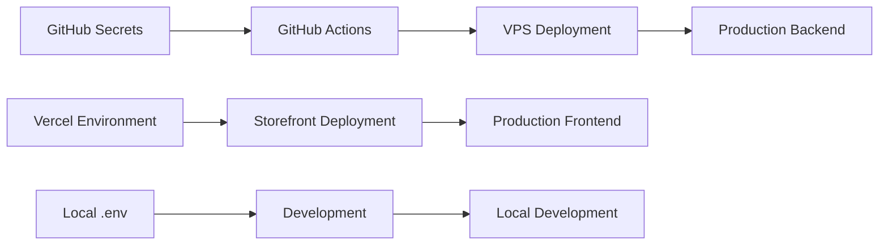

# GitHub Secrets & Environment Configuration

**Last Updated**: January 7, 2026
**Status**: Consolidated from setup-deployment documentation

Complete guide for configuring GitHub secrets and environment variables across all platforms.

---

## Table of Contents

1. [Overview](#overview)
2. [GitHub Secrets Setup](#github-secrets-setup)
3. [Vercel Environment Variables](#vercel-environment-variables)
4. [Meilisearch Configuration](#meilisearch-configuration)
5. [Security Best Practices](#security-best-practices)

---

## Overview

The BusBasisBerlin project requires environment configuration across three platforms:



### Configuration Flow
1. **GitHub Secrets** → Used by GitHub Actions for backend deployment
2. **Vercel Environment Variables** → Used by Vercel for storefront deployment
3. **Local .env** → Used for local development

---

## GitHub Secrets Setup

### Complete Secrets List

```bash
# Domain & SSL
DOMAIN_NAME=basiscamp-berlin.de
SSL_CERT_NAME=fullchain.pem
SSL_KEY_NAME=privkey.pem

# Database
POSTGRES_PASSWORD=secure_random_password_here

# Redis (Fixed Dec 29, 2025)
REDIS_PASSWORD=secure_redis_password_here

# Medusa Core
JWT_SECRET=jwt_secret_key_here
COOKIE_SECRET=cookie_secret_key_here

# Email (Resend)
RESEND_API_KEY=re_your_api_key_here
RESEND_FROM_EMAIL=noreply@basiscamp-berlin.de

# Storage (Supabase)
S3_ACCESS_KEY_ID=your_access_key
S3_SECRET_ACCESS_KEY=your_secret_key
S3_REGION=eu-central-1
S3_BUCKET=your_bucket_name
S3_ENDPOINT=https://xxxxx.supabase.co/storage/v1
S3_FILE_URL=https://xxxxx.supabase.co/storage/v1/object/public/

# Meilisearch
MEILISEARCH_HOST=http://medusa_meilisearch:7700
MEILISEARCH_MASTER_KEY=your_master_key_here
MEILISEARCH_API_KEY=your_api_key_here
MEILISEARCH_PRODUCT_INDEX_NAME=products

# Payment (Stripe)
STRIPE_API_KEY=sk_live_your_key_here
STRIPE_WEBHOOK_SECRET=whsec_your_secret_here

# Company Information
COMPANY_NAME="Basis Camp Berlin"
COMPANY_EMAIL=info@basiscamp-berlin.de
COMPANY_PHONE="+49 30 12345678"
COMPANY_ADDRESS="Your Street 123"
COMPANY_POSTAL_CODE="12345"
COMPANY_CITY="Berlin"
COMPANY_TAX_ID="DE123456789"
COMPANY_BANK_INFO="Your Bank Details"
COMPANY_LOGO_URL=https://basiscamp-berlin.de/logo.png
COMPANY_SUPPORT_EMAIL=support@basiscamp-berlin.de
BRAND_PRIMARY_COLOR="#000000"
BRAND_SECONDARY_COLOR="#666666"

# URLs & CORS
MEDUSA_BACKEND_URL=https://basiscamp-berlin.de
STOREFRONT_URL=https://medusa-js-busbasisberlin-storefront.vercel.app
STORE_CORS=https://medusa-js-busbasisberlin-storefront.vercel.app,http://localhost:8000
ADMIN_CORS=https://basiscamp-berlin.de
AUTH_CORS=https://basiscamp-berlin.de

# Email Content
PDF_FOOTER_TEXT="Your footer text here"
EMAIL_SIGNATURE="Your signature"
EMAIL_FOOTER="Your email footer"

# Vercel Integration
VERCEL_DEPLOY_HOOK=https://api.vercel.com/v1/integrations/deploy/xxxxx
```

### Automated Setup Script

Use the provided script to set all secrets at once:

```bash
cd setup-deployment
./set-github-secrets.sh
```

**What it does**:
- Reads secrets from environment or prompts for input
- Sets all GitHub repository secrets
- Validates required secrets are present
- Provides confirmation of successful setup

### Manual Setup (Alternative)

**Via GitHub Web Interface**:
1. Go to repository → Settings → Secrets and variables → Actions
2. Click "New repository secret"
3. Add each secret from the list above

**Via GitHub CLI**:
```bash
# Install GitHub CLI if needed
brew install gh

# Login
gh auth login

# Set secrets
gh secret set DOMAIN_NAME --body "basiscamp-berlin.de"
gh secret set POSTGRES_PASSWORD --body "your_password"
# ... repeat for all secrets
```

---

## Vercel Environment Variables

### Required Variables

**Backend Connection**:
```
NEXT_PUBLIC_MEDUSA_BACKEND_URL=https://basiscamp-berlin.de
MEDUSA_BACKEND_URL=https://basiscamp-berlin.de
```

**Cache Revalidation**:
```
REVALIDATE_SECRET=supersecret_revalidate_key
```

**Analytics/Tracking** (if applicable):
```
NEXT_PUBLIC_GOOGLE_ANALYTICS_ID=GA-XXXXXXX
NEXT_PUBLIC_VERCEL_ANALYTICS=1
```

### Setup Methods

#### Via Vercel Dashboard
1. Go to Vercel project → Settings → Environment Variables
2. Add each variable for Production, Preview, and Development
3. Redeploy to apply changes

#### Via Vercel CLI
```bash
# Install and login
npm i -g vercel
vercel login

# Set environment variables
vercel env add NEXT_PUBLIC_MEDUSA_BACKEND_URL
vercel env add REVALIDATE_SECRET

# Pull for local development
vercel env pull .env.local
```

#### Local Development (.env.local)
```env
# Create in storefront root
NEXT_PUBLIC_MEDUSA_BACKEND_URL=http://localhost:9000
REVALIDATE_SECRET=supersecret
```

---

## Meilisearch Configuration

### Setup Order

**Step 1**: Set master key in GitHub secrets
```
MEILISEARCH_MASTER_KEY=secure_random_string_16_chars_minimum
```

**Step 2**: Deploy backend (creates Meilisearch container)

**Step 3**: Generate API key
```bash
# SSH to VPS after deployment
ssh deploy@your-vps
cd /opt/medusa-app/busbasisberlin

# Generate search-only API key
docker exec medusa_meilisearch curl -X POST 'http://localhost:7700/keys' \
  -H 'Content-Type: application/json' \
  -H "Authorization: Bearer $(docker exec medusa_meilisearch printenv MEILI_MASTER_KEY)" \
  --data-binary '{
    "description": "Medusa Search Key",
    "actions": ["search"],
    "indexes": ["products", "categories"],
    "expiresAt": null
  }'
```

**Step 4**: Add API key to GitHub secrets and Vercel
```
MEILISEARCH_API_KEY=generated_key_from_step_3
```

### Key Types and Usage

| Key Type | Purpose | Where Used | Permissions |
|----------|---------|------------|-------------|
| **Master Key** | Full admin access | Backend container | All operations |
| **API Key** | Search operations | Frontend/Storefront | Search only |
| **Search Key** | Public search | Frontend (if direct access) | Search specific indexes |

### Environment-Specific Configuration

#### Backend (GitHub Secrets)
```
MEILISEARCH_HOST=http://medusa_meilisearch:7700  # Docker internal
MEILISEARCH_MASTER_KEY=your_master_key
MEILISEARCH_API_KEY=your_api_key
MEILISEARCH_PRODUCT_INDEX_NAME=products
```

#### Frontend (Vercel - if direct access needed)
```
NEXT_PUBLIC_MEILISEARCH_HOST=https://basiscamp-berlin.de/search
NEXT_PUBLIC_MEILISEARCH_API_KEY=search_only_key
```

**Note**: Currently the frontend uses Medusa API endpoints (`/store/meilisearch/*`), not direct Meilisearch access.

### Verification Commands

**Check Meilisearch is running**:
```bash
ssh deploy@your-vps
docker ps | grep meilisearch
```

**Test connection**:
```bash
# From VPS
docker exec medusa_meilisearch curl http://localhost:7700/health

# From backend container
docker exec medusa_backend_server_blue curl \
  -H "Authorization: Bearer YOUR_API_KEY" \
  http://medusa_meilisearch:7700/indexes
```

**List indexes** (should show products, categories):
```bash
docker exec medusa_meilisearch curl -X GET 'http://localhost:7700/indexes' \
  -H "Authorization: Bearer YOUR_API_KEY"
```

---

## Security Best Practices

### Secret Generation

**Strong passwords/keys**:
```bash
# Generate secure random strings
openssl rand -base64 32  # For passwords
openssl rand -hex 32     # For tokens
node -e "console.log(require('crypto').randomBytes(32).toString('base64'))"
```

**Key requirements**:
- Minimum 16 characters for Meilisearch master key
- Use mix of letters, numbers, symbols
- Different keys for different environments
- Rotate keys periodically

### Secret Management

**✅ Do**:
- Use GitHub secrets for sensitive data
- Different keys for development/production
- Regular key rotation (quarterly)
- Audit secret access logs
- Use principle of least privilege

**❌ Don't**:
- Commit secrets to version control
- Share master keys publicly
- Use simple or short passwords
- Reuse keys across different services
- Expose internal URLs externally

### Environment Separation

| Environment | Secret Source | Access Level |
|-------------|---------------|--------------|
| **Local Development** | `.env.local` | Full (for testing) |
| **GitHub Actions** | Repository secrets | Deploy-only |
| **VPS Production** | Generated from secrets | Runtime-only |
| **Vercel Production** | Vercel environment | Frontend-only |

---

## Troubleshooting

### Common Issues

#### "Secret not found" in GitHub Actions
```bash
# Check if secret exists
gh secret list | grep SECRET_NAME

# Set missing secret
gh secret set SECRET_NAME --body "value"
```

#### Meilisearch connection failures
```bash
# Verify master key length (minimum 16 chars)
echo "YOUR_MASTER_KEY" | wc -c

# Check container logs
docker logs medusa_meilisearch --tail 50
```

#### Vercel deployment failures
```bash
# Check environment variables
vercel env ls

# Pull current config
vercel env pull .env.local
```

#### CORS issues
```bash
# Verify CORS settings match actual domains
# Check STORE_CORS includes your storefront URL
# No trailing slashes, exact domain match
```

### Emergency Recovery

#### Reset all GitHub secrets
```bash
cd setup-deployment
./clean-github-secrets.sh  # Removes all
./set-github-secrets.sh    # Recreates all
```

#### Regenerate Meilisearch keys
```bash
# SSH to VPS
ssh deploy@your-vps
cd /opt/medusa-app/busbasisberlin

# Stop Meilisearch
docker stop medusa_meilisearch

# Remove data volume (WARNING: deletes all search data)
docker volume rm busbasisberlin_meilisearch_data

# Restart with new master key
docker compose up -d medusa_meilisearch
```

---

## Validation Checklist

### After Setting GitHub Secrets
- [ ] All required secrets present: `gh secret list`
- [ ] Deployment workflow succeeds
- [ ] Containers start without environment errors
- [ ] Backend health check passes

### After Setting Vercel Variables
- [ ] Storefront builds successfully
- [ ] Frontend can connect to backend
- [ ] API calls work from browser
- [ ] No CORS errors in console

### After Meilisearch Setup
- [ ] Meilisearch container running
- [ ] Health endpoint responds
- [ ] Can list indexes
- [ ] Product search works
- [ ] Categories are indexed

---

## Quick Reference

### Get Current Secret Values (Emergency)
```bash
# From VPS (production values)
ssh deploy@your-vps
cd /opt/medusa-app/busbasisberlin
grep "SECRET_NAME=" .env.production

# From GitHub (check if set)
gh secret list
```

### Update Single Secret
```bash
# GitHub
gh secret set SECRET_NAME --body "new_value"

# Vercel
vercel env add SECRET_NAME
```

### Test Configuration
```bash
# Backend health
curl https://basiscamp-berlin.de/health

# Frontend health
curl https://medusa-js-busbasisberlin-storefront.vercel.app/api/health

# Meilisearch health
curl https://basiscamp-berlin.de/search/health
```

---

This consolidated guide replaces all previous secret management documentation and provides a single source of truth for environment configuration.
