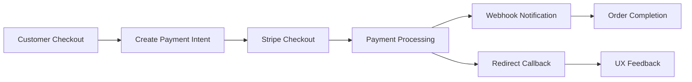

# Feature Integrations Guide

**Last Updated**: January 7, 2026
**Status**: Consolidated from feature documentation

Complete guide for all feature integrations in the BusBasisBerlin project.

---

## Table of Contents

1. [Internationalization (i18n)](#internationalization-i18n)
2. [Stripe Payment Integration](#stripe-payment-integration)
3. [Meilisearch Integration](#meilisearch-integration)
4. [Email System](#email-system)
5. [Announcement Banners](#announcement-banners)

---

## Internationalization (i18n)

### Overview
Full German/English language support using next-intl with localized content, tax-inclusive pricing, and legal compliance.

### Implementation Details

**Framework**: next-intl for Next.js App Router
**Languages**: German (de), English (en)
**Default**: German (de)

**URL Structure**:
```
https://domain.com/de/products    # German
https://domain.com/en/products    # English
https://domain.com/products       # Redirects to /de/products
```

**Configuration**:
```typescript
// src/i18n/request.ts
import { getRequestConfig } from 'next-intl/server';

export default getRequestConfig(async ({ locale }) => ({
  messages: (await import(`../../messages/${locale}.json`)).default
}));
```

**Message Files**:
- `messages/de.json` - German translations
- `messages/en.json` - English translations

### Key Features

**Localized Content**:
- Product names, descriptions, categories
- UI labels, buttons, navigation
- Error messages and notifications
- Email templates in both languages

**Tax-Inclusive Pricing**:
- German: "inkl. MwSt." (including VAT)
- English: "incl. VAT"
- Automatic tax calculation per region

**Legal Compliance**:
- Dedicated pages for Terms, Privacy Policy, Imprint
- Linkable from emails and external sources
- Accessible via modal or direct URL
- Fully translated legal text

### Usage Examples

**In Components**:
```typescript
import { useTranslations } from 'next-intl';

export default function ProductCard() {
  const t = useTranslations('Products');

  return (
    <div>
      <h3>{t('title')}</h3>
      <p>{t('price')} {t('tax_inclusive')}</p>
    </div>
  );
}
```

**In Messages**:
```json
// messages/de.json
{
  "Products": {
    "title": "Produkte",
    "price": "Preis",
    "tax_inclusive": "inkl. MwSt."
  }
}

// messages/en.json
{
  "Products": {
    "title": "Products",
    "price": "Price",
    "tax_inclusive": "incl. VAT"
  }
}
```

---

## Stripe Payment Integration

### Overview
Best practices compliant Stripe integration with webhook-driven order completion and proper error handling.

### Configuration

**Environment Variables**:
```env
# Use test keys for development
STRIPE_API_KEY=sk_test_your_test_key
STRIPE_WEBHOOK_SECRET=whsec_your_test_secret

# Production keys
STRIPE_API_KEY=sk_live_your_live_key
STRIPE_WEBHOOK_SECRET=whsec_your_live_secret
```

**Webhook URL**: `https://your-domain.de/hooks/payment/stripe`

### Implementation Strategy

**✅ Webhook as Source of Truth**:
- Webhooks are authoritative for payment status
- Handles race conditions between webhook and redirect
- Redirect callback provides UX fallback only

**✅ Payment Intent Lifecycle**:
- Handles all PaymentIntent states correctly
- Never attempts to cancel succeeded intents
- Webhook processes async state changes

**Required Webhook Events**:
```
payment_intent.succeeded
payment_intent.payment_failed
payment_intent.amount_capturable_updated
payment_intent.requires_action
payment_intent.processing
```

### Capture Strategy

**Current Configuration**: Auto-capture enabled (`capture: true`)

**Appropriate for**:
- Standard card payments
- Immediate payment confirmation
- Real-time order fulfillment

**For delayed confirmation methods** (bank transfer, etc.):
- Places order immediately
- Webhook completes payment when confirmed
- Order status updates automatically

### Integration Flow



**The redirect callback** at `/api/capture-payment/[cartId]` handles:
- Payment validation before order placement
- Race conditions with webhook completion
- Graceful error handling for async payment methods

---

## Meilisearch Integration

### Overview
Advanced product search powered by Meilisearch with real-time synchronization and category faceting.

### Configuration

**Environment Variables**:
```env
# Backend (use internal Docker network URL)
MEILISEARCH_HOST=http://medusa_meilisearch:7700
MEILISEARCH_API_KEY=your_master_key
MEILISEARCH_MASTER_KEY=your_master_key
MEILISEARCH_PRODUCT_INDEX_NAME=products
MEILISEARCH_CATEGORY_INDEX_NAME=categories

# Frontend (use public domain)
NEXT_PUBLIC_MEILISEARCH_HOST=https://your-domain.de/meilisearch
NEXT_PUBLIC_MEILISEARCH_API_KEY=your_search_only_key
```

### Features

**Real-time Synchronization**:
- Products sync to Meilisearch on create/update via event subscribers
- Category faceting and hierarchical filtering
- SKU and handle search support
- Product availability integration
- Automatic index management

**Search Capabilities**:
- Fast product search by name, SKU, description
- Category-based filtering with hierarchy
- Real-time availability checking
- Typo-tolerant search
- Faceted search with filters

### Event-Driven Sync Architecture

**Data Flow**:
```
Product Update → product.updated event → OfferModule Subscriber → Meilisearch Index
```

**Subscribers** (located in `src/subscribers/`):
- `product-sync.ts` - Product creation and updates
- `inventory-meilisearch.ts` - Inventory changes
- `category-sync.ts` - Category modifications
- `meilisearch-sync.ts` - General index updates

### Creating Search-Only API Key

```bash
# For frontend use (read-only)
curl -X POST 'http://localhost:7700/keys' \
  -H 'Authorization: Bearer <MASTER_KEY>' \
  -H 'Content-Type: application/json' \
  --data-binary '{
    "description": "Search-only key for storefront",
    "actions": ["search"],
    "indexes": ["products", "categories"],
    "expiresAt": null
  }'
```

---

## Email System

### Overview
Pre-configured transactional email templates using React Email and Resend with German language support.

### Email Templates

**Order Lifecycle** (4 templates):
1. ✅ **order-placed** - Order confirmation
2. ✅ **order-shipped** - Shipping confirmation with tracking
3. ✅ **order-delivered** - Delivery confirmation
4. ✅ **order-cancelled** - Cancellation & refund

**User Management** (2 templates):
5. ✅ **reset-password** - Password reset link
6. ✅ **user-invited** - Admin team invitation

**Offers** (4 templates):
7. ✅ **offer-active** - Offer ready notification
8. ✅ **offer-accepted** - Offer acceptance confirmation
9. ✅ **offer-completed** - Completion notification
10. ✅ **offer-cancelled** - Cancellation notice

### Email Features

**All emails include**:
- Company branding and styling
- Responsive design
- German language support
- PDF attachments (for offers and invoices)
- Unified branding with configurable colors

### Configuration

**Email Notification Preferences** (via Admin UI):
1. Navigate to: **Settings** → **Offer Email Notifications**
2. Toggle notifications ON/OFF for each status
3. Default settings:
   - Offer Active: ON ✅
   - Offer Accepted: ON ✅
   - Offer Completed: ON ✅
   - Offer Created: OFF
   - Offer Cancelled: OFF

**Environment Variables**:
```env
RESEND_API_KEY=re_your_api_key
RESEND_FROM_EMAIL=noreply@yourdomain.com

# Company branding (for emails and PDFs)
COMPANY_NAME="Your Company Name"
COMPANY_EMAIL=info@yourdomain.com
COMPANY_PHONE="+49 30 12345678"
COMPANY_ADDRESS="Street 123"
COMPANY_POSTAL_CODE="12345"
COMPANY_CITY="Berlin"
COMPANY_LOGO_URL=https://yourdomain.com/logo.png
BRAND_PRIMARY_COLOR="#000000"
BRAND_SECONDARY_COLOR="#666666"
```

---

## Announcement Banners

### Overview
Configurable announcement banner system for displaying important messages across the admin dashboard.

### Features

**Banner Management**:
- Create, edit, and delete announcements
- Rich text content support
- Scheduling (start/end dates)
- Priority levels for display order
- Target audience selection

**Display Options**:
- Global banners (all users)
- Role-based banners (admin only, etc.)
- Page-specific banners
- Dismissible vs persistent banners

### Configuration

**Admin Interface**:
- Navigate to: **Settings** → **Announcements**
- Create new announcements with:
  - Title and rich text content
  - Start and end dates
  - Priority level (1-10)
  - Target pages or global
  - Dismissible setting

**Banner Types**:
- **Info**: General information (blue)
- **Warning**: Important notices (yellow)
- **Error**: Critical alerts (red)
- **Success**: Positive announcements (green)

### Usage in Admin UI

**Display Logic**:
- Banners appear at top of admin pages
- Sorted by priority (highest first)
- Respect start/end date constraints
- Remember dismissed state per user

**Example Implementation**:
```typescript
// In admin components
import { AnnouncementBanner } from '@/admin/components/AnnouncementBanner';

export default function AdminLayout() {
  return (
    <div>
      <AnnouncementBanner page="global" />
      {/* Rest of admin content */}
    </div>
  );
}
```

---

## Integration Testing

### Setup Testing Environment

**Test Data**:
```bash
# Load test data for all modules
npx medusa exec src/scripts/seed.ts

# Import sample suppliers
npx medusa exec src/scripts/import-suppliers.ts

# Import sample services
npx medusa exec src/scripts/import-services.ts
```

### End-to-End Testing

**Complete Flow Testing**:
1. **Product Management**: Create product → appears in search → available for offers
2. **Supplier Integration**: Link supplier to product → pricing data available
3. **Offer Creation**: Create offer with products and services → PDF generates → email sends
4. **Order Processing**: Accept offer → inventory reserves → order creates
5. **Payment Flow**: Process payment → webhook triggers → order completes

**Search Integration**:
1. Create/update product in admin
2. Verify appears in Meilisearch within seconds
3. Search from storefront
4. Verify faceting and filtering works

**Email Integration**:
1. Configure Resend API key
2. Create test offer
3. Change offer status → email should send
4. Check email received with PDF attachment

---

This comprehensive integration guide consolidates all feature documentation while maintaining the detailed implementation information from the original files.
