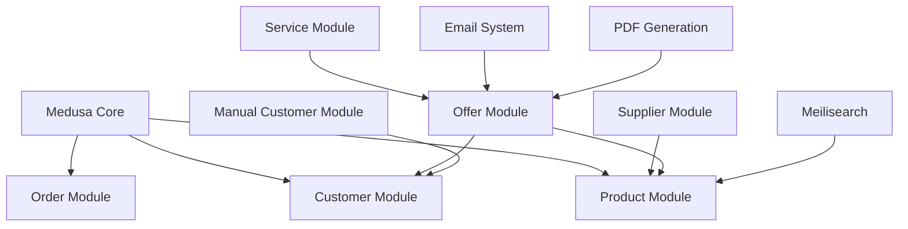

# Custom Modules Overview

**Last Updated**: January 7, 2026
**Status**: Consolidated from all module README files

Complete documentation for all custom business modules in the BusBasisBerlin project.

---

## Table of Contents

1. [Module Architecture](#module-architecture)
2. [Supplier Module](#supplier-module)
3. [Offer Module](#offer-module)
4. [Service Module](#service-module)
5. [Manual Customer Module](#manual-customer-module)
6. [Integration Patterns](#integration-patterns)

---

## Module Architecture

### Overview

The BusBasisBerlin project extends Medusa with 4 custom modules that provide complete ERP functionality:



### Module Integration

**With Medusa Core**:
- Suppliers link to Products via many-to-many relationships
- Offers link to Customers and Products
- Services can be included in Offers
- Manual Customers can be linked to Core Customers

**With External Systems**:
- **Meilisearch**: Real-time product/service sync via event subscribers
- **Email System**: Automated notifications for offer status changes
- **PDF Generation**: DIN 5008 compliant documents for offers
- **File Storage**: S3-compatible storage for PDFs and images

---

## Supplier Module

### Purpose
Complete supplier management with contact information, addresses, product relationships, and pricing data.

### Core Features

**Supplier Management**:
- Complete CRUD operations for suppliers
- Company details (name, VAT ID, business status)
- Bank information (IBAN, BIC, account details)
- Lead time tracking and delivery times
- Website and internal notes

**Contact Management**:
- Multiple contacts per supplier
- Contact details (name, department, salutation)
- Multiple phone numbers and email addresses per contact
- Flexible contact labeling

**Address Management**:
- Multiple addresses per supplier
- Complete address information (street, postal code, city, country)
- Address labeling and categorization

**Product Relationships**:
- Many-to-many relationship between products and suppliers
- Supplier-specific pricing (net and gross)
- Supplier SKUs and product names
- Lead times and minimum order quantities
- Primary supplier designation per product

### Data Models

**Supplier**:
```typescript
{
  id: string;
  supplier_number: string | null;
  company: string;
  company_addition: string | null;
  vat_id: string | null;
  business_status: string | null;
  language: string | null;
  lead_time_days: number | null;
  website: string | null;
  notes: string | null;
  bank_iban: string | null;
  bank_bic: string | null;
  bank_account_holder: string | null;
  bank_name: string | null;
  created_at: Date;
  updated_at: Date;
}
```

**Supplier Contact**:
```typescript
{
  id: string;
  supplier_id: string;
  salutation: string | null;
  first_name: string | null;
  last_name: string | null;
  department: string | null;
  phones: SupplierContactPhone[];
  emails: SupplierContactEmail[];
}
```

**Product Supplier Relationship**:
```typescript
{
  product_id: string;
  supplier_id: string;
  supplier_sku: string | null;
  supplier_product_name: string | null;
  net_price: number | null;
  gross_price: number | null;
  currency_code: string;
  vat_rate: string | null;
  lead_time_days: number | null;
  minimum_quantity: number | null;
  is_primary: boolean;
}
```

### Admin UI Features

**Supplier List Page** (`/app/lieferanten`):
- Searchable supplier list with pagination
- Column visibility controls
- Sorting by company, status, creation date
- Bulk operations and CSV export

**Supplier Detail Page** (`/app/lieferanten/[id]`):
- Complete supplier information editing
- Contact and address management
- Product relationship overview
- Pricing and lead time management

### API Endpoints

```
GET    /admin/suppliers              # List suppliers with pagination/search
POST   /admin/suppliers              # Create new supplier
GET    /admin/suppliers/[id]         # Get supplier details
PUT    /admin/suppliers/[id]         # Update supplier
DELETE /admin/suppliers/[id]         # Delete supplier
GET    /admin/suppliers/[id]/products # Get supplier's products
```

---

## Offer Module

### Purpose
Complete ERP offer/quotation management system with inventory reservation, PDF generation, email notifications, and status workflow management.

### Core Features

**Offer Lifecycle**:
- **Automatic Numbering**: Sequential offer numbers (ANG-00001, ANG-00002)
- **Status Workflow**: Draft → Active → Accepted → Completed/Cancelled
- **Bidirectional Transitions**: Can transition between Active ↔ Accepted states
- **Price Snapshotting**: Prices captured at creation for integrity

**Inventory Management**:
- **Manual Reservation**: Reserve inventory via button click
- **Manual Release**: Release reservations without status change
- **Automatic Release**: Released when cancelled or completed
- **Reservation Tracking**: Each reservation includes offer number
- **Stock Availability**: Real-time inventory checking

**Document Generation**:
- **PDF Generation**: DIN 5008 compliant German business documents
- **Automatic Caching**: PDFs cached and regenerable on demand
- **Template-Based**: Handlebars templates for customization
- **S3 Storage**: Long-term PDF storage

**Communication**:
- **Email Templates**: Status-specific email templates
  - Active: "Ihr Angebot ist bereit"
  - Accepted: "Angebot angenommen - Bestätigung"
  - Completed: "Angebot erfolgreich abgeschlossen"
  - Cancelled: "Angebot storniert"
- **Preview Functionality**: Preview email and PDF before sending
- **PDF Attachments**: Automatic PDF attachment to emails
- **Granular Control**: Per-offer email preferences

### Data Models

**Offer**:
```typescript
{
  id: string;
  offer_number: string;           // ANG-00001, ANG-00002, etc.
  status: OfferStatus;            // draft, active, accepted, completed, cancelled
  customer_id: string | null;     // Link to Medusa customer
  manual_customer_id: string | null; // Link to manual customer

  // Financial
  subtotal: number;               // in cents
  tax_total: number;              // in cents
  total: number;                  // in cents
  currency_code: string;          // EUR, USD, etc.

  // Dates
  valid_until: Date | null;       // Offer expiry
  created_at: Date;
  updated_at: Date;

  // Content
  notes: string | null;           // Internal notes
  customer_notes: string | null;  // Notes for customer

  // Relations
  items: OfferItem[];             // Products and services
  reservations: InventoryReservation[]; // Inventory reservations
}
```

**Offer Item**:
```typescript
{
  id: string;
  offer_id: string;
  type: 'product' | 'service';

  // Product items
  product_id: string | null;
  variant_id: string | null;

  // Service items
  service_id: string | null;

  // Common fields
  quantity: number;
  unit_price: number;             // Price at time of offer creation
  total_price: number;            // quantity * unit_price
  title: string;                  // Snapshot of product/service title
  sku: string | null;             // Snapshot of SKU
  tax_rate: number;               // Tax rate at time of creation
}
```

### Workflows

**Offer Status Workflow**:
```typescript
// src/workflows/offer/update-status.ts
export const updateOfferStatusWorkflow = createWorkflow(
  'update-offer-status',
  function (input: { offer_id: string; status: OfferStatus }) {
    // Step 1: Validate status transition
    const validation = validateStatusTransitionStep(input);

    // Step 2: Update offer status
    const updatedOffer = updateOfferStep(validation);

    // Step 3: Handle inventory (reserve/release based on status)
    const inventoryResult = handleInventoryStep(updatedOffer);

    // Step 4: Generate PDF if needed
    const pdfResult = generatePdfStep(updatedOffer);

    // Step 5: Send email notification
    const emailResult = sendEmailNotificationStep({
      offer: updatedOffer,
      pdf_url: pdfResult.pdf_url
    });

    return new WorkflowResponse(updatedOffer);
  }
);
```

### Admin UI Features

**Offer List Page** (`/app/offers`):
- Status-based filtering (Draft, Active, Accepted, etc.)
- Search by offer number, customer name
- Bulk status updates
- Export functionality

**Offer Detail Page** (`/app/offers/[id]`):
- Complete offer editing
- Status transition buttons
- Inventory reservation controls
- PDF preview and download
- Email preview and sending
- Item management (add/remove products/services)

### API Endpoints

```
GET    /admin/offers                 # List offers with filtering
POST   /admin/offers                 # Create new offer
GET    /admin/offers/[id]            # Get offer details
PUT    /admin/offers/[id]            # Update offer
DELETE /admin/offers/[id]            # Delete offer
POST   /admin/offers/[id]/status     # Update status (triggers workflow)
POST   /admin/offers/[id]/reserve    # Manual inventory reservation
POST   /admin/offers/[id]/release    # Manual inventory release
GET    /admin/offers/[id]/pdf        # Generate/download PDF
POST   /admin/offers/[id]/email      # Send email notification
```

---

## Service Module

### Purpose
Service catalog management for offering services alongside products in offers and orders.

### Core Features

**Service Catalog**:
- Complete CRUD operations for services
- Flexible pricing models (base price or hourly rate)
- Service categorization (Wartung, Reparatur, Beratung)
- Service types (Stunden, Pauschal, Material)
- Duration estimation in minutes

**Service Management**:
- Active/inactive status management
- Featured service designation
- Service requirements tracking
- Integration with offers

### Data Models

**Service**:
```typescript
{
  id: string;
  title: string;
  description: string | null;
  short_description: string | null;
  category: string | null;        // "Wartung", "Reparatur", "Beratung"
  service_type: string | null;    // "Stunden", "Pauschal", "Material"

  // Pricing (flexible model)
  base_price: number | null;      // Fixed price in cents
  hourly_rate: number | null;     // Hourly rate in cents
  currency_code: string;          // Default: EUR

  // Service Details
  estimated_duration: number | null; // in minutes
  is_active: boolean;             // Default: true
  is_featured: boolean;           // Default: false

  // Requirements
  requires_vehicle: boolean;      // Default: false
  requires_diagnosis: boolean;    // Default: false
  requires_approval: boolean;     // Default: false

  created_at: Date;
  updated_at: Date;
}
```

### Admin UI Features

**Service List Page** (`/app/services`):
- Category-based filtering and organization
- Search by service name or description
- Bulk status updates (active/inactive)
- Pricing management
- Service requirements overview

**Service Detail Page** (`/app/services/[id]`):
- Complete service information editing
- Pricing model selection (base vs hourly)
- Category and type management
- Requirements configuration

### API Endpoints

```
GET    /admin/services              # List services with filtering
POST   /admin/services              # Create new service
GET    /admin/services/[id]         # Get service details
PUT    /admin/services/[id]         # Update service
DELETE /admin/services/[id]         # Delete service
GET    /admin/service-categories    # Get service categories
```

### Integration with Offers

Services can be added to offers alongside products:

```typescript
// In offer items
{
  type: 'service',
  service_id: 'serv_123',
  quantity: 2,                    // e.g., 2 hours
  unit_price: 5000,              // €50.00 per hour (in cents)
  total_price: 10000,            // €100.00 total
  title: 'Brake Service',        // Snapshot at offer creation
  sku: 'SRV-BRAKE-001'
}
```

---

## Manual Customer Module

### Purpose
Flexible customer management for legacy customers, walk-in customers, and business customers with incomplete information.

### Core Features

**Customer Types**:
- **Legacy Customers**: From other systems without email addresses
- **Walk-in Customers**: Physical store customers
- **Business Customers**: Incomplete information during initial contact
- **Linked Customers**: Can be linked to core Medusa customers

**Customer Management**:
- Complete customer information (name, contact details, addresses)
- Customer numbering system
- Purchase history tracking
- Status management (active/inactive)
- Customer type categorization

### Data Models

**Manual Customer**:
```typescript
{
  id: string;
  customer_number: string;        // Custom numbering system
  customer_type: string;          // "business", "individual", "legacy"
  status: string;                 // "active", "inactive"

  // Personal Information
  salutation: string | null;      // "Herr", "Frau", "Firma"
  first_name: string | null;
  last_name: string | null;
  company: string | null;

  // Contact Information
  email: string | null;           // Optional (for legacy customers)
  phone: string | null;
  website: string | null;

  // Address
  street: string | null;
  postal_code: string | null;
  city: string | null;
  country: string | null;

  // Business Information
  vat_id: string | null;
  tax_rate: string | null;

  // Integration
  core_customer_id: string | null; // Link to Medusa customer

  // Tracking
  total_purchases: number;        // Count of purchases
  total_spent: number;            // Total amount spent (in cents)
  last_purchase_date: Date | null;

  created_at: Date;
  updated_at: Date;
}
```

### Admin UI Features

**Manual Customer List Page** (`/app/manual-customers`):
- Customer type filtering (business, individual, legacy)
- Status filtering (active, inactive)
- Search by name, company, email, customer number
- Column-based filtering
- Purchase history overview

**Manual Customer Detail Page** (`/app/manual-customers/[id]`):
- Complete customer information editing
- Link to core Medusa customer
- Purchase history tracking
- Contact and address management

### API Endpoints

```
GET    /admin/manual-customers       # List customers with filtering
POST   /admin/manual-customers       # Create new customer
GET    /admin/manual-customers/[id]  # Get customer details
PUT    /admin/manual-customers/[id]  # Update customer
DELETE /admin/manual-customers/[id]  # Delete customer
POST   /admin/manual-customers/[id]/link # Link to core customer
```

### Integration with Orders

Manual customers can be used in offers and linked to core customers:

```typescript
// In offers
{
  customer_id: null,              // No core customer
  manual_customer_id: 'mcust_123', // Use manual customer
  // ...
}

// After linking to core customer
{
  customer_id: 'cust_456',        // Now has core customer
  manual_customer_id: 'mcust_123', // Maintains manual customer link
  // ...
}
```

---

## Integration Patterns

### Event-Driven Architecture

**Product Sync**:
```typescript
// src/subscribers/product-sync.ts
export default async function productSyncHandler(
  { event: { data } }: SubscriberArgs<{ id: string }>
) {
  // Sync to Meilisearch
  await syncProductToMeilisearch(data.id);

  // Update supplier relationships
  await updateSupplierProductPricing(data.id);
}
```

**Offer Status Changes**:
```typescript
// src/subscribers/offer-events.ts
export default async function offerStatusHandler(
  { event: { data } }: SubscriberArgs<{ id: string; status: string }>
) {
  // Handle inventory based on status
  if (data.status === 'cancelled') {
    await releaseInventoryReservations(data.id);
  }

  // Send email notifications
  await sendOfferStatusEmail(data.id, data.status);
}
```

### Workflow Integration

**Complex Operations Use Workflows**:
```typescript
// Example: Creating offer with inventory reservation
export const createOfferWithReservationWorkflow = createWorkflow(
  'create-offer-with-reservation',
  function (input: CreateOfferInput) {
    // Step 1: Create offer
    const offer = createOfferStep(input);

    // Step 2: Reserve inventory for products
    const reservations = reserveInventoryStep({
      offer_id: offer.id,
      items: input.items
    });

    // Step 3: Generate PDF
    const pdf = generateOfferPdfStep(offer);

    // Step 4: Send notification email
    const email = sendOfferCreatedEmailStep({
      offer,
      pdf_url: pdf.url
    });

    return new WorkflowResponse({ offer, reservations, pdf, email });
  }
);
```

### Database Relationships

```sql
-- Product-Supplier many-to-many
CREATE TABLE product_supplier (
  product_id VARCHAR NOT NULL,
  supplier_id VARCHAR NOT NULL,
  supplier_sku VARCHAR,
  net_price INTEGER,
  is_primary BOOLEAN DEFAULT FALSE,
  PRIMARY KEY (product_id, supplier_id)
);

-- Offer items (products and services)
CREATE TABLE offer_item (
  id VARCHAR PRIMARY KEY,
  offer_id VARCHAR NOT NULL,
  type VARCHAR NOT NULL, -- 'product' or 'service'
  product_id VARCHAR,    -- NULL for service items
  service_id VARCHAR,    -- NULL for product items
  quantity INTEGER NOT NULL,
  unit_price INTEGER NOT NULL,
  total_price INTEGER NOT NULL
);

-- Manual customer linking
CREATE TABLE manual_customer (
  id VARCHAR PRIMARY KEY,
  customer_number VARCHAR UNIQUE,
  core_customer_id VARCHAR, -- Links to Medusa customer
  -- ... other fields
);
```

---

## Development Patterns

### Module Structure

Each module follows this structure:
```
src/modules/[module-name]/
├── models/                     # Data models and types
├── services/                   # Business logic services
├── workflows/                  # Complex operations
├── migrations/                 # Database migrations
├── admin/                      # Admin UI routes (if any)
├── api/                        # API route handlers (if any)
└── README.md                   # Module documentation
```

### Service Layer Pattern

```typescript
// services/[module].ts
export class ModuleService {
  constructor(
    private readonly container: MedusaContainer,
    private readonly logger: Logger
  ) {}

  async list(filters: FilterOptions, config: FindConfig): Promise<ListResult> {
    // Implementation with proper filtering, pagination
  }

  async retrieve(id: string, config?: FindConfig): Promise<Entity> {
    // Implementation with relations loading
  }

  async create(data: CreateInput): Promise<Entity> {
    // Implementation with validation and event emission
  }

  async update(id: string, data: UpdateInput): Promise<Entity> {
    // Implementation with change tracking
  }

  async delete(id: string): Promise<void> {
    // Implementation with cleanup and event emission
  }
}
```

### Admin UI Pattern

```typescript
// admin/routes/[module]/page.tsx
export default function ModulePage() {
  // Use React Query for data fetching
  const { data, isLoading } = useQuery({
    queryKey: ['module-list', filters],
    queryFn: () => fetch('/admin/module').then(res => res.json())
  });

  // Use shared components where possible
  const { visibleColumns, toggleColumn } = useColumnVisibility({
    storageKey: 'module-columns',
    defaultVisibleColumns: ['name', 'status', 'actions']
  });

  // Render with Medusa UI components
  return (
    <Container>
      <ModuleTable data={data} visibleColumns={visibleColumns} />
    </Container>
  );
}
```

---

## Testing Strategy

### Module Testing

**Service Tests**:
```typescript
// tests/modules/supplier/supplier.service.spec.ts
describe('SupplierService', () => {
  it('should create supplier with contacts', async () => {
    const supplier = await supplierService.create({
      company: 'Test Supplier',
      contacts: [{ email: 'test@example.com' }]
    });

    expect(supplier.company).toBe('Test Supplier');
    expect(supplier.contacts).toHaveLength(1);
  });
});
```

**Workflow Tests**:
```typescript
// tests/workflows/offer/create-offer.spec.ts
describe('Create Offer Workflow', () => {
  it('should create offer and reserve inventory', async () => {
    const result = await createOfferWorkflow.run({
      input: {
        customer_id: 'cust_123',
        items: [{ product_id: 'prod_123', quantity: 2 }]
      }
    });

    expect(result.offer).toBeDefined();
    expect(result.reservations).toHaveLength(1);
  });
});
```

### API Testing

```typescript
// integration-tests/http/offers.spec.ts
medusaIntegrationTestRunner({
  testSuite: ({ api }) => {
    describe('Offers API', () => {
      it('should create offer via API', async () => {
        const response = await api.post('/admin/offers', {
          customer_id: 'cust_123',
          items: [{ product_id: 'prod_123', quantity: 1 }]
        });

        expect(response.status).toBe(200);
        expect(response.data.offer.offer_number).toMatch(/ANG-\d{5}/);
      });
    });
  }
});
```

---

## Future Enhancements

### Planned Features

**Supplier Module**:
- Automated purchase order generation
- Supplier performance tracking
- Lead time analytics
- Integration with inventory forecasting

**Offer Module**:
- Offer templates for common configurations
- Automated follow-up workflows
- Integration with accounting systems
- Multi-currency offer support

**Service Module**:
- Service scheduling and calendar integration
- Time tracking for hourly services
- Service history and customer preferences
- Recurring service offerings

**Manual Customer Module**:
- Customer segmentation and analytics
- Automated customer data enrichment
- Integration with marketing tools
- Customer communication history

---

This comprehensive module documentation provides complete reference for all custom business logic in the BusBasisBerlin project.
