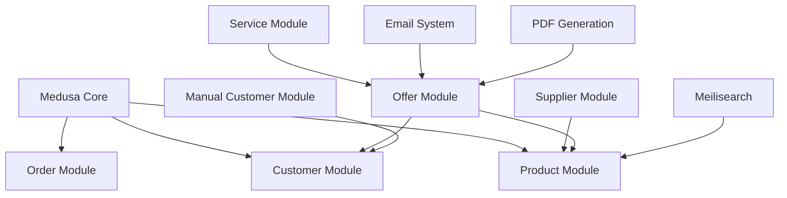

# Custom Modules: Complete ERP System

**Last Updated**: January 7, 2026
**Status**: Consolidated from 4 module README files

Complete documentation for the custom business modules that extend MedusaJS with ERP functionality.

---

## Module Overview

The BusBasisBerlin project includes 4 custom modules that provide complete ERP functionality:

1. **[Supplier Module](#supplier-module)** - Supplier management with contacts, addresses, and product relationships
2. **[Offer Module](#offer-module)** - Complete quotation system with inventory, PDF, and email workflows
3. **[Service Module](#service-module)** - Service catalog with flexible pricing models
4. **[Manual Customer Module](#manual-customer-module)** - Legacy and walk-in customer management

### Module Integration



---

## Supplier Module

### Overview
Complete supplier management system with contact information, addresses, product relationships, and pricing data.

### Core Features

**Supplier Management**:
- Complete CRUD operations for suppliers
- Company details (name, addition, VAT ID)
- Bank information (IBAN, BIC, account details)
- Business status and language preferences
- Lead time tracking and delivery times
- Website and internal notes

**Contact Management**:
- Multiple contacts per supplier with emails and phones
- Contact details (name, department, salutation)
- Multiple phone numbers and email addresses per contact
- Flexible contact labeling and categorization

**Address Management**:
- Multiple addresses per supplier
- Complete address information (street, postal code, city, country)
- Address labeling and categorization

**Product Relationships**:
- Many-to-many relationship between products and suppliers
- Supplier-specific pricing (net and gross)
- Supplier SKUs and product names
- Lead times and minimum order quantities
- Primary supplier designation per product
- CSV import support (JTL VAP format compatible)

### Data Models

**Supplier**:
```typescript
{
  id: string;
  supplier_number: string | null;
  customer_number: string | null;
  internal_key: string | null;
  company: string;
  company_addition: string | null;
  vat_id: string | null;
  status: string; // default: 'active'
  is_active: boolean; // default: true
  language: string; // default: 'Deutsch'
  lead_time: number | null; // in days
  website: string | null;
  note: string | null;

  // Bank details
  bank_name: string | null;
  bank_code: string | null;
  account_number: string | null;
  account_holder: string | null;
  iban: string | null;
  bic: string | null;

  // Relations
  contacts: SupplierContact[];
  addresses: SupplierAddress[];
  products: ProductSupplier[];
}
```

**Product-Supplier Relationship**:
```typescript
{
  product_id: string;
  supplier_id: string;
  supplier_sku: string | null;
  supplier_product_name: string | null;
  net_price: number | null; // in cents
  gross_price: number | null; // in cents
  currency_code: string; // default: 'EUR'
  vat_rate: string | null;
  lead_time_days: number | null;
  minimum_quantity: number | null;
  is_primary: boolean; // default: false
  stock_quantity: number | null;
  merge_stock: boolean; // default: false
}
```

### Admin UI

**Supplier List** (`/app/lieferanten`):
- Searchable supplier list with pagination and sorting
- Column visibility controls for customizable views
- Bulk operations and CSV export functionality
- Advanced filtering by status, location, contact information

**Supplier Detail** (`/app/lieferanten/[id]`):
- Complete supplier information editing
- Contact and address management interface
- Product relationship overview with pricing
- Lead time and delivery management

### API Endpoints

```
GET    /admin/suppliers              # List with pagination/search/sort
POST   /admin/suppliers              # Create new supplier
GET    /admin/suppliers/[id]         # Get supplier with relations
PUT    /admin/suppliers/[id]         # Update supplier information
DELETE /admin/suppliers/[id]         # Delete supplier
GET    /admin/suppliers/[id]/products # Get supplier's product relationships
```

---

## Offer Module

### Overview
Complete ERP offer/quotation management system with inventory reservation, PDF generation, email notifications, and status workflow management.

### Core Features

**Offer Lifecycle**:
- **Automatic Numbering**: Sequential offer numbers (ANG-00001, ANG-00002)
- **Status Workflow**: Draft → Active → Accepted → Completed/Cancelled
- **Bidirectional Transitions**: Can transition between Active ↔ Accepted states
- **Product & Service Items**: Support for both products and services in offers
- **Price Snapshotting**: Prices and tax rates captured at offer creation for integrity

**Inventory Management**:
- **Manual Reservation**: Reserve inventory via button click (draft/active statuses)
- **Manual Release**: Release reservations without status change (active/accepted statuses)
- **Automatic Release**: Reservations released when offer cancelled or completed
- **Reservation Tracking**: Each reservation includes offer number in description
- **Stock Availability**: Real-time inventory availability checking

**Document Generation**:
- **DIN 5008 Compliant**: German standard compliant PDF generation
- **Automatic Caching**: PDFs cached and regenerable on demand
- **Template-Based**: Handlebars templates for customization
- **S3 Storage**: PDFs stored for long-term access

**Communication**:
- **Status-Based Templates**: Different email templates for each status
  - Active: "Ihr Angebot ist bereit"
  - Accepted: "Angebot angenommen - Bestätigung"
  - Completed: "Angebot erfolgreich abgeschlossen"
  - Cancelled: "Angebot storniert"
- **Preview Functionality**: Preview email and PDF before sending
- **PDF Attachments**: PDF automatically attached to emails
- **Granular Control**: Per-offer email notification preferences

### Status Workflow

**Valid Transitions**:
```
draft → active → accepted → completed
  ↓       ↓         ↓          ↓
  ↓       ↓         ↓          ↓
  ↓       ↓         ↓          ↓
cancelled (from any status)
```

**Bidirectional Transitions**:
- `active` ↔ `accepted` (maintains reservations)
- `active` → `draft` (releases reservations)

**Status Descriptions**:
- **draft**: Initial state, no inventory impact
- **active**: Offer is active, can have reservations
- **accepted**: Customer has accepted, reservations maintained
- **completed**: Order fulfilled, inventory reduced, reservations released
- **cancelled**: Offer cancelled, reservations released

### Data Models

**Offer**:
```typescript
{
  id: string;
  offer_number: string;           // ANG-00001, ANG-00002, etc.
  status: OfferStatus;            // draft, active, accepted, completed, cancelled
  customer_id: string | null;     // Link to Medusa customer
  manual_customer_id: string | null; // Link to manual customer

  // Financial
  subtotal: number;               // in cents
  tax_total: number;              // in cents
  total: number;                  // in cents
  currency_code: string;          // EUR, USD, etc.

  // Dates
  valid_until: Date | null;       // Offer expiry
  created_at: Date;
  updated_at: Date;

  // Content
  notes: string | null;           // Internal notes
  customer_notes: string | null;  // Notes for customer

  // Relations
  items: OfferItem[];             // Products and services
  reservations: InventoryReservation[]; // Inventory reservations
}
```

### Workflows

**Offer Status Workflow**:
```typescript
export const updateOfferStatusWorkflow = createWorkflow(
  'update-offer-status',
  function (input: { offer_id: string; status: OfferStatus }) {
    // Step 1: Validate status transition
    const validation = validateStatusTransitionStep(input);

    // Step 2: Update offer status
    const updatedOffer = updateOfferStep(validation);

    // Step 3: Handle inventory (reserve/release based on status)
    const inventoryResult = handleInventoryStep(updatedOffer);

    // Step 4: Generate PDF if needed
    const pdfResult = generatePdfStep(updatedOffer);

    // Step 5: Send email notification
    const emailResult = sendEmailNotificationStep({
      offer: updatedOffer,
      pdf_url: pdfResult.pdf_url
    });

    return new WorkflowResponse(updatedOffer);
  }
);
```

### Admin UI

**Offer List** (`/app/offers`):
- Status-based filtering (Draft, Active, Accepted, etc.)
- Search by offer number, customer name
- Bulk status updates and operations
- Export functionality with date ranges

**Offer Detail** (`/app/offers/[id]`):
- Complete offer editing interface
- Status transition buttons with validation
- Inventory reservation controls
- PDF preview and download
- Email preview and sending
- Item management (add/remove products/services)

---

## Service Module

### Overview
Service catalog management for offering services alongside products in offers and orders.

### Core Features

**Service Catalog**:
- Complete CRUD operations for services
- Flexible pricing models (base price or hourly rate)
- Service categorization (Wartung, Reparatur, Beratung)
- Service types (Stunden, Pauschal, Material)
- Duration estimation in minutes
- Active/inactive status management
- Featured service designation

**Service Requirements**:
- Requires vehicle (checkbox)
- Requires diagnosis (checkbox)
- Requires approval (checkbox)

### Data Models

**Service**:
```typescript
{
  id: string;
  title: string;
  description: string | null;
  short_description: string | null;
  category: string | null;        // "Wartung", "Reparatur", "Beratung"
  service_type: string | null;    // "Stunden", "Pauschal", "Material"

  // Pricing (flexible model)
  base_price: number | null;      // Fixed price in cents
  hourly_rate: number | null;     // Hourly rate in cents
  currency_code: string;          // Default: EUR

  // Service Details
  estimated_duration: number | null; // in minutes
  is_active: boolean;             // Default: true
  is_featured: boolean;           // Default: false

  // Requirements
  requires_vehicle: boolean;      // Default: false
  requires_diagnosis: boolean;    // Default: false
  requires_approval: boolean;     // Default: false

  created_at: Date;
  updated_at: Date;
}
```

### Admin UI

**Service List** (`/app/services`):
- Category-based filtering and organization
- Search by service name or description
- Bulk status updates (active/inactive)
- Pricing management interface
- Service requirements overview

**Service Detail** (`/app/services/[id]`):
- Complete service information editing
- Pricing model selection (base vs hourly)
- Category and type management
- Requirements configuration

### Integration with Offers

Services can be added to offers alongside products:

```typescript
// In offer items
{
  type: 'service',
  service_id: 'serv_123',
  quantity: 2,                    // e.g., 2 hours
  unit_price: 5000,              // €50.00 per hour (in cents)
  total_price: 10000,            // €100.00 total
  title: 'Brake Service',        // Snapshot at offer creation
  sku: 'SRV-BRAKE-001'
}
```

---

## Manual Customer Module

### Overview
Flexible customer management for legacy customers from other systems, walk-in customers without email addresses, and business customers with incomplete information.

### Core Features

**Customer Types**:
- **Legacy Customers**: From other systems without email addresses
- **Walk-in Customers**: Physical store customers
- **Business Customers**: Incomplete information during initial contact
- **Linked Customers**: Can be linked to core Medusa customers

**Customer Management**:
- Complete customer information (name, contact details, addresses)
- Customer numbering system
- Purchase history tracking
- Status management (active/inactive)
- Customer type categorization

### Data Models

**Manual Customer**:
```typescript
{
  id: string;
  customer_number: string;        // Custom numbering system
  customer_type: string;          // "business", "individual", "legacy"
  status: string;                 // "active", "inactive"

  // Personal Information
  salutation: string | null;      // "Herr", "Frau", "Firma"
  first_name: string | null;
  last_name: string | null;
  company: string | null;

  // Contact Information
  email: string | null;           // Optional (for legacy customers)
  phone: string | null;
  website: string | null;

  // Address
  street: string | null;
  postal_code: string | null;
  city: string | null;
  country: string | null;

  // Business Information
  vat_id: string | null;
  tax_rate: string | null;

  // Integration
  core_customer_id: string | null; // Link to Medusa customer

  // Tracking
  total_purchases: number;        // Count of purchases
  total_spent: number;            // Total amount spent (in cents)
  last_purchase_date: Date | null;

  created_at: Date;
  updated_at: Date;
}
```

### Integration with Orders

Manual customers can be used in offers and linked to core customers:

```typescript
// In offers
{
  customer_id: null,              // No core customer initially
  manual_customer_id: 'mcust_123', // Use manual customer
}

// After linking to core customer
{
  customer_id: 'cust_456',        // Now has core customer
  manual_customer_id: 'mcust_123', // Maintains manual customer link
}
```

---

## Module Architecture

### File Structure

Each module follows this structure:
```
src/modules/[module-name]/
├── models/                     # Data models and types
├── services/                   # Business logic services
├── workflows/                  # Complex operations
├── migrations/                 # Database migrations
├── admin/                      # Admin UI routes (if any)
├── api/                        # API route handlers (if any)
└── README.md                   # Module documentation
```

### Service Layer Pattern

```typescript
export class ModuleService {
  constructor(
    private readonly container: MedusaContainer,
    private readonly logger: Logger
  ) {}

  async list(filters: FilterOptions, config: FindConfig): Promise<ListResult> {
    // Implementation with proper filtering, pagination
  }

  async retrieve(id: string, config?: FindConfig): Promise<Entity> {
    // Implementation with relations loading
  }

  async create(data: CreateInput): Promise<Entity> {
    // Implementation with validation and event emission
  }

  async update(id: string, data: UpdateInput): Promise<Entity> {
    // Implementation with change tracking
  }

  async delete(id: string): Promise<void> {
    // Implementation with cleanup and event emission
  }
}
```

### Event Integration

**Product Sync**:
```typescript
// src/subscribers/product-sync.ts
export default async function productSyncHandler(
  { event: { data } }: SubscriberArgs<{ id: string }>
) {
  // Sync to Meilisearch
  await syncProductToMeilisearch(data.id);

  // Update supplier relationships
  await updateSupplierProductPricing(data.id);
}
```

**Offer Status Changes**:
```typescript
// src/subscribers/offer-events.ts
export default async function offerStatusHandler(
  { event: { data } }: SubscriberArgs<{ id: string; status: string }>
) {
  // Handle inventory based on status
  if (data.status === 'cancelled') {
    await releaseInventoryReservations(data.id);
  }

  // Send email notifications
  await sendOfferStatusEmail(data.id, data.status);
}
```

---

## API Patterns

### Standard Endpoints

All modules follow consistent API patterns:

```
GET    /admin/[module]              # List with pagination/search/sort
POST   /admin/[module]              # Create new entity
GET    /admin/[module]/[id]         # Get entity with relations
PUT    /admin/[module]/[id]         # Update entity
DELETE /admin/[module]/[id]         # Delete entity
```

### Request/Response Format

**List Response**:
```typescript
{
  [module]: Entity[];
  stats: {
    total: number;
    active: number;
    inactive: number;
    // Module-specific stats
  };
}
```

**Detail Response**:
```typescript
{
  [module]: Entity & {
    // Loaded relations
    contacts?: Contact[];
    addresses?: Address[];
    items?: Item[];
  };
}
```

---

## Database Schema

### Relationships

```sql
-- Supplier relationships
CREATE TABLE supplier (id, company, vat_id, ...);
CREATE TABLE supplier_contact (id, supplier_id, first_name, ...);
CREATE TABLE supplier_address (id, supplier_id, street, ...);
CREATE TABLE product_supplier (product_id, supplier_id, net_price, ...);

-- Offer relationships
CREATE TABLE offer (id, offer_number, status, customer_id, ...);
CREATE TABLE offer_item (id, offer_id, type, product_id, service_id, ...);

-- Service relationships
CREATE TABLE service (id, title, category, base_price, hourly_rate, ...);

-- Manual customer relationships
CREATE TABLE manual_customer (id, customer_number, core_customer_id, ...);
```

### Constraints and Indexes

```sql
-- Unique constraints
ALTER TABLE supplier ADD CONSTRAINT unique_supplier_number UNIQUE (supplier_number);
ALTER TABLE offer ADD CONSTRAINT unique_offer_number UNIQUE (offer_number);
ALTER TABLE manual_customer ADD CONSTRAINT unique_customer_number UNIQUE (customer_number);

-- Performance indexes
CREATE INDEX idx_supplier_company ON supplier(company);
CREATE INDEX idx_offer_status ON offer(status);
CREATE INDEX idx_offer_customer ON offer(customer_id);
CREATE INDEX idx_service_category ON service(category);
```

---

## Testing Strategy

### Module Testing

**Service Tests**:
```typescript
describe('SupplierService', () => {
  it('should create supplier with contacts', async () => {
    const supplier = await supplierService.create({
      company: 'Test Supplier',
      contacts: [{ email: 'test@example.com' }]
    });

    expect(supplier.company).toBe('Test Supplier');
    expect(supplier.contacts).toHaveLength(1);
  });
});
```

**Workflow Tests**:
```typescript
describe('Create Offer Workflow', () => {
  it('should create offer and reserve inventory', async () => {
    const result = await createOfferWorkflow.run({
      input: {
        customer_id: 'cust_123',
        items: [{ product_id: 'prod_123', quantity: 2 }]
      }
    });

    expect(result.offer).toBeDefined();
    expect(result.reservations).toHaveLength(1);
  });
});
```

### Integration Testing

```typescript
medusaIntegrationTestRunner({
  testSuite: ({ api }) => {
    describe('Suppliers API', () => {
      it('should list suppliers with pagination', async () => {
        const response = await api.get('/admin/suppliers?limit=10');
        expect(response.status).toBe(200);
        expect(response.data.suppliers).toBeDefined();
      });
    });
  }
});
```

---

This comprehensive guide consolidates all module documentation into a single reference while maintaining the detailed information from the original README files.
