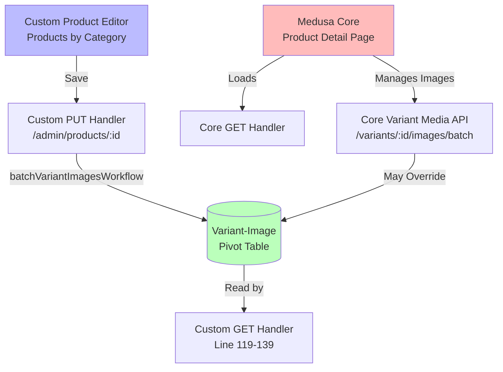
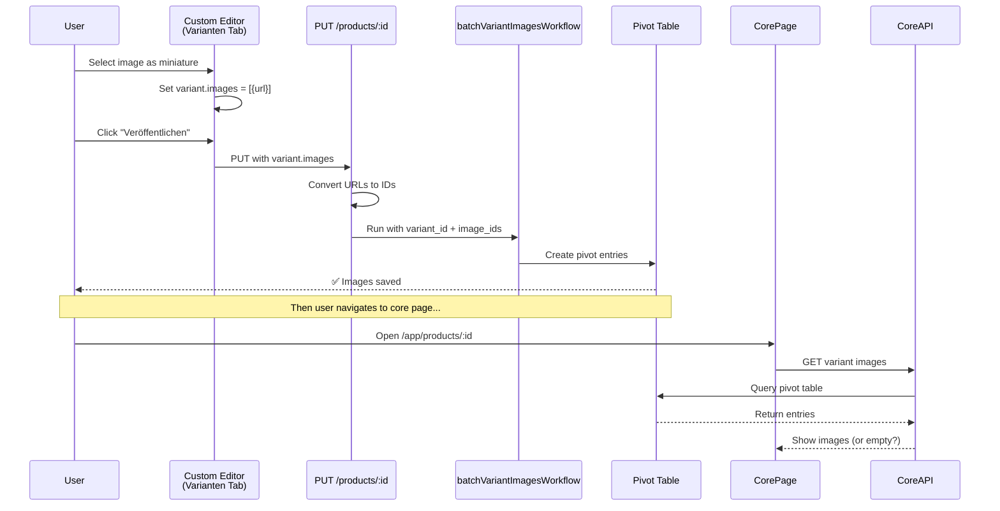

# Variant Images Issue - Medusa Core vs Custom Editor Conflict

## Problem Statement

When editing a product in our custom "Products by Category" editor:
1. Select a variant image (miniature/thumbnail) in the **Varianten** tab
2. Save the product successfully
3. Navigate to Medusa's core product detail page
4. The variant image **disappears** - shows 0 images

## Evidence from Logs

### Successful Save from Custom Editor
```
[PRODUCT-UPDATE] Variant 0 (MM-05-001): 1 images, thumbnail: .../MM-05-001-2.jpg
[PRODUCT-UPDATE] Variant variant_01K5CAVYQ26VCDHTDVJP6VPNMC: 1 desired URLs -> 1 IDs, 1 current IDs
[PRODUCT-UPDATE] Variant variant_01K5CAVYQ26VCDHTDVJP6VPNMC: 0 to add, 0 to remove
```
✅ Images detected and processed during save

### After Navigating to Core Product Page
```
[PRODUCT-GET] Variant 0 (MM-05-001): 0 images
```
❌ Images disappeared

### Medusa Core API Calls
```
POST /admin/products/.../variants/.../images/batch (200) - 24.416 ms
POST /admin/products/.../variants/.../images/batch (200) - 202.886 ms
```
⚠️ Medusa's core variant media management is being invoked

## Current Architecture



## Key Code Sections

### Custom GET Handler (Line 119-139)
```typescript
// Filter variant images to only include images specifically associated with each variant
if (product.variants && product.images) {
    const imageVariantMap = new Map<string, string[]>();
    for (const image of product.images as any[]) {
        const variantIds = (image.variants || []).map((v: any) => v.id);
        imageVariantMap.set(image.id, variantIds);
    }

    for (const variant of product.variants) {
        const variantImages: any[] = [];
        for (const image of product.images) {
            const associatedVariants = imageVariantMap.get(image.id) || [];
            // Include image if it's specifically associated with this variant
            if (associatedVariants.includes(variant.id)) {
                variantImages.push({ id: image.id, url: image.url });
            }
        }
        variant.images = variantImages;
    }
}
```

**Logic**:
- Reads `image.variants` array (pivot table relationships)
- Only includes images where the variant ID is in the image's variants array
- If NO pivot entries exist for an image, it won't be associated with ANY variant

### Custom PUT Handler (Line 646-863)
```typescript
// Process each variant's images
for (let i = 0; i < variants.length; i++) {
    const variant = variants[i];
    const desiredImageUrls = variant.images
        ? variant.images.map((img: any) => img.url).filter(Boolean)
        : [];

    // Convert desired URLs to IDs
    const desiredImageIds = desiredImageUrls.map(...).filter(Boolean);

    // Uses batchVariantImagesWorkflow to update associations
    await batchVariantImagesWorkflow(req.scope).run({
        input: {
            variant_id: updatedVariant.id,
            image_ids: imagesToAdd,
        },
    });
}
```

**Logic**:
- Takes variant.images from frontend
- Converts URLs to image IDs
- Calls `batchVariantImagesWorkflow` to create pivot entries

### Medusa's Variant Image Model

In Medusa v2, variant-image associations work via a **pivot table**:

**Table**: `product_variant_product_image` (or similar)
**Columns**: `variant_id`, `image_id`

**Rules**:
1. Images with NO pivot entries = "general" images → displayed on ALL variants
2. Images WITH pivot entries = "specific" images → only on associated variants
3. If ANY image has a pivot entry, ALL images should have pivot entries to avoid conflicts

## Questions for Medusa Docs AI

### 1. Variant Images Best Practices

**Question**: What is the correct way to manage variant-specific images in Medusa v2 when using both custom admin routes AND the core product detail page?

**Context**:
- We have a custom product editor that uses `batchVariantImagesWorkflow`
- Users also access Medusa's core product detail page (`/app/products/:id`)
- Changes made in one interface seem to be lost when accessing the other

**Specific concerns**:
- Should variant images be managed ONLY through workflows?
- Is there a way to make custom variant images persist when viewed in core UI?
- Do we need to customize the core product detail page to respect our variant images?

### 2. Variant Images Workflow Usage

**Question**: Are we using `batchVariantImagesWorkflow` correctly for variant image associations?

**Our implementation**:
```typescript
// Convert variant.images from frontend (array of {url} objects) to image IDs
const desiredImageIds = variant.images
    .map(img => imageUrlToIdMap.get(img.url))
    .filter(Boolean);

// Call workflow
await batchVariantImagesWorkflow(req.scope).run({
    input: {
        variant_id: variant.id,
        image_ids: desiredImageIds,
    },
});
```

**Questions**:
- Is this the correct input format?
- Should we be using `add` and `remove` arrays instead of just `image_ids`?
- Do we need to clear existing associations first?

### 3. Image-Variant Pivot Table

**Question**: How does Medusa v2 determine which images to show for a variant?

**Our understanding**:
1. Query `product.images` with `image.variants` populated
2. For each image, check if `image.variants` includes the variant ID
3. If yes, include; if no, exclude

**Questions**:
- Is this the correct logic?
- Are "general" images (no pivot entries) automatically shown on all variants?
- How does `fields` parameter affect which images are returned?

### 4. Core Product Page Variant Media

**Question**: When users access `/app/products/:id` (Medusa's core product page) and manage variant images, does it:
- Override ALL variant-image associations?
- Append to existing associations?
- Only modify what's shown in the UI?

**Context**:
We see these API calls from the core page:
```
GET /admin/products/:id/variants/:id?fields=...,+images.id,+images.url,+images.variants.id
POST /admin/products/:id/variants/:id/images/batch
```

**Questions**:
- What does the `images/batch` endpoint do exactly?
- Does it clear existing pivot entries?
- Can we customize this endpoint to respect our variant images?

### 5. Recommended Architecture

**Question**: For a system with both custom product management AND core Medusa product pages, what's the recommended architecture for variant images?

**Options we're considering**:
- **A**: Only manage variant images through custom editor, hide core variant media UI
- **B**: Synchronize between both interfaces somehow
- **C**: Use only Medusa's core UI for variant images, remove custom implementation
- **D**: Customize Medusa's core product page to use our variant image logic

Which approach aligns with Medusa best practices?

## Current Custom Editor Flow



## Hypothesis

The issue might be one of:

1. **Fields mismatch**: Core page requests different fields than custom editor
2. **Workflow conflict**: Core page uses different workflow that clears our associations
3. **Query logic**: Our GET handler filters images incorrectly
4. **Pivot table**: Entries aren't being created correctly by `batchVariantImagesWorkflow`

## Request for Medusa AI

Please help us understand:

1. ✅ Correct usage of `batchVariantImagesWorkflow`
2. ✅ How core product page variant media management works
3. ✅ Whether our approach conflicts with Medusa's architecture
4. ✅ Recommended solution for managing variant images in both custom and core UIs
5. ✅ Any known issues with variant images in Medusa v2

## Technical Details

**Medusa Version**: v2 (latest)
**Database**: PostgreSQL with standard Medusa schema
**Custom Module**: Product management via custom admin routes
**Workflow Used**: `batchVariantImagesWorkflow` from `@medusajs/medusa/core-flows`

Thank you!

