# Offer Inventory Reservation & Release Flow

## Current State Visualization

```mermaid
flowchart TD
    Start([Offer Created]) --> Draft[Draft Status<br/>📦 Stock: 100<br/>🔒 Reserved: 0<br/>✅ Available: 100]

    Draft -->|Manual Button Click| ReserveBtn[Reserve Inventory Button<br/>Available: draft/active]
    ReserveBtn -->|Creates Reservations| Active[Active Status<br/>📦 Stock: 100<br/>🔒 Reserved: 10<br/>✅ Available: 90]

    Draft -->|Status Change: draft → active| ActiveNoReserve[Active Status<br/>No Reservations<br/>📦 Stock: 100<br/>🔒 Reserved: 0<br/>✅ Available: 100]

    Active -->|Status Change: active → accepted| Accepted[Accepted Status<br/>Reservations Maintained<br/>📦 Stock: 100<br/>🔒 Reserved: 10<br/>✅ Available: 90]

    Active -->|Status Change: active → cancelled| CancelledActive[Cancelled Status<br/>Reservations Released<br/>📦 Stock: 100<br/>🔒 Reserved: 0<br/>✅ Available: 100]

    Accepted -->|Status Change: accepted → completed| Completed[Completed Status<br/>Inventory Reduced<br/>Reservations Released<br/>📦 Stock: 90<br/>🔒 Reserved: 0<br/>✅ Available: 90]

    Accepted -->|Status Change: accepted → cancelled| CancelledAccepted[Cancelled Status<br/>Reservations Released<br/>📦 Stock: 100<br/>🔒 Reserved: 0<br/>✅ Available: 100]

    Draft -->|Status Change: draft → cancelled| CancelledDraft[Cancelled Status<br/>No Action Needed<br/>📦 Stock: 100<br/>🔒 Reserved: 0<br/>✅ Available: 100]

    Completed --> Terminal1[Terminal State<br/>❌ No Further Transitions]
    CancelledActive --> Terminal2[Terminal State<br/>❌ No Further Transitions]
    CancelledAccepted --> Terminal3[Terminal State<br/>❌ No Further Transitions]
    CancelledDraft --> Terminal4[Terminal State<br/>❌ No Further Transitions]

    %% Currently NOT ALLOWED transitions
    Accepted -.->|❌ NOT ALLOWED| Active
    Active -.->|❌ NOT ALLOWED| Draft
    Completed -.->|❌ NOT ALLOWED| Accepted
    Completed -.->|❌ NOT ALLOWED| Active

    style Draft fill:#e3f2fd,stroke:#1976d2
    style Active fill:#fff3e0,stroke:#f57c00
    style ActiveNoReserve fill:#fff3e0,stroke:#f57c00
    style Accepted fill:#e8f5e9,stroke:#388e3c
    style Completed fill:#f3e5f5,stroke:#7b1fa2
    style CancelledActive fill:#ffebee,stroke:#c62828
    style CancelledAccepted fill:#ffebee,stroke:#c62828
    style CancelledDraft fill:#ffebee,stroke:#c62828
    style ReserveBtn fill:#bbdefb,stroke:#1976d2
    style Terminal1 fill:#bdbdbd,stroke:#616161
    style Terminal2 fill:#bdbdbd,stroke:#616161
    style Terminal3 fill:#bdbdbd,stroke:#616161
    style Terminal4 fill:#bdbdbd,stroke:#616161
```



## Inventory Operations Summary

### Reservation (Manual Button)
- **When**: User clicks "Reserve Inventory" button
- **Status Requirements**: Offer must be `draft` or `active`
- **Action**: Creates reservations (holds inventory, doesn't reduce stock)
- **Result**:
  - Stock: Unchanged (100)
  - Reserved: Increases (0 → 10)
  - Available: Decreases (100 → 90)

### Active → Accepted Transition
- **Action**: No inventory change
- **Result**:
  - Stock: Unchanged (100)
  - Reserved: Maintained (10)
  - Available: Unchanged (90)

### Accepted → Completed Transition
- **Action**:
  1. Reduce physical inventory (stocked_quantity decreased)
  2. Release reservations
- **Result**:
  - Stock: Reduced (100 → 90)
  - Reserved: Released (10 → 0)
  - Available: Updated (90)

### Any → Cancelled Transition
- **Action**: Release reservations (if any exist)
- **Result**:
  - Stock: Unchanged (100)
  - Reserved: Released (10 → 0)
  - Available: Restored (90 → 100)

## Current Limitations

1. **No Bidirectional Transitions**:
   - Cannot go from `accepted` → `active`
   - Cannot go from `active` → `draft`
   - Cannot go from `completed` → any other status

2. **No Manual Release Button**:
   - Reservations can only be released via status transitions
   - No way to release reservations without changing status

3. **Reservation Metadata**:
   - Currently includes: `type`, `offer_id`, `offer_item_id`, `variant_id`, `sku`, `created_at`
   - Missing: `offer_number` (e.g., ANG-00009)
   - Missing: Description field (if Medusa supports it)

## Reservation Metadata Structure

```typescript
metadata: {
  type: 'offer',
  offer_id: 'offer_123',
  offer_item_id: 'item_456',
  variant_id: 'variant_789',
  sku: 'AHK-3TO',
  created_at: '2025-11-01T10:00:00Z'
  // Missing: offer_number: 'ANG-00009'
  // Missing: description: 'Reservation for offer ANG-00009'
}
```

